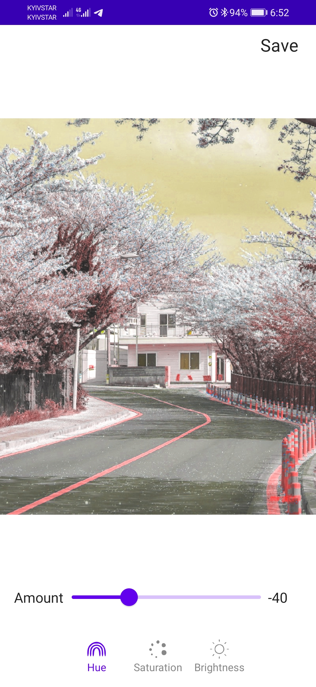

# flab - Simple Photo Editor

flab is a simple photo edit app that supports basic color adjustments and some default color effects.
App is powered by OpenCV library

### Components used
* MVVM
* Jetpack Compose
* Multi-module
* Navigation Component
* Kotlin Coroutines

### Features
* select image from gallery
* create photo from built-in camera
* adjust contrast and brightness
* adjust hue, saturation and lightness
* adjust sharpness
* rotate / flip
* apply default color filters
* undo applied changes before leaving environment
* change original source without closing app
* save to gallery

### Screenshots

  
   
   
   
   
   
   

